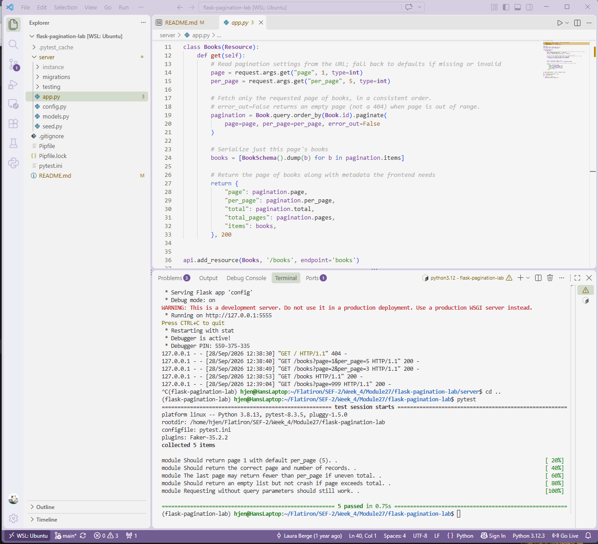

# Lab: Flask Pagination
**Completed Sept 28, 2026**

## Description

A Flask REST API that serves a catalog of books with **server-side pagination**. Instead of returning every record at once, the `/books` endpoint returns one page at a time, along with metadata the frontend can use to build page navigation.
 

 
## Features
 
- `GET /books` returns a paginated list of books
- `page` and `per_page` query parameters control which chunk of data is returned
- Response includes metadata: current page, page size, total records, and total pages
- Sensible defaults (page 1, 5 per page) when parameters are missing or invalid
- Out-of-range pages return an empty list instead of an error
- Books are returned in a consistent order (by `id`) so pages never overlap or skip records
## Tech Stack
 
- Python 3.8
- Flask & Flask-RESTful
- Flask-SQLAlchemy (using `.paginate()`)
- Flask-Migrate / Alembic
- Marshmallow (serialization)
- SQLite
- Faker (seed data)
- pytest
## Installation
 
Clone the repository and install dependencies:
 
```bash
git clone https://github.com/hanjennings1/flask-pagination-lab.git
cd flask-pagination-lab
pipenv install && pipenv shell
```
 
Set up the database and seed it with 500 sample books:
 
```bash
cd server
flask db upgrade head
python seed.py
```
 
## Usage
 
Start the server from the `server` directory:
 
```bash
python app.py
```
 
The API runs at `http://localhost:5555`.
 
### Endpoint
 
`GET /books`
 
| Query parameter | Type | Default | Description |
| --------------- | ---- | ------- | ------------------------------ |
| `page` | int | `1` | Which page of results to return |
| `per_page` | int | `5` | Number of books per page |
 
### Examples
 
```
GET /books
GET /books?page=2&per_page=3
GET /books?page=999
```
 
### Example response
 
`GET /books?page=1&per_page=2`
 
```json
{
  "page": 1,
  "per_page": 2,
  "total": 500,
  "total_pages": 250,
  "items": [
    {
      "id": 1,
      "title": "Example book title.",
      "author": "Jane Doe",
      "description": "A short description of the book."
    },
    {
      "id": 2,
      "title": "Another example title.",
      "author": "John Smith",
      "description": "Another short description."
    }
  ]
}
```
 
| Field | Description |
| ------------- | ------------------------------------------ |
| `page` | The current page number |
| `per_page` | Number of items per page |
| `total` | Total number of books in the database |
| `total_pages` | Total number of pages at this page size |
| `items` | The books on the current page |
 
## Running Tests
 
From the project root:
 
```bash
pytest
```
 
The test suite uses an in-memory database seeded with 20 books and checks default pagination, custom page sizes, partial last pages, and out-of-range pages.
 
## Project Structure
 
```
flask-pagination-lab/
├── server/
│   ├── app.py          # Books resource with pagination logic
│   ├── config.py       # App factory, database and API setup
│   ├── models.py       # Book model and Marshmallow schema
│   ├── seed.py         # Seeds the database with fake books
│   ├── migrations/     # Alembic migration files
│   └── testing/        # pytest test suite
├── Pipfile
├── pytest.ini
└── README.md
```
 